# Building Content Cards

Displaying content cards within your custom UI can be achieved by combining custom payloads in your conversation, and combining these with Soul Machines showcards and hidecards speech markers.

Your conversation should send JSON data about your content card to the UI using a custom payload sent with the conversation response. Your conversation should also place a showcards speech marker inline in the conversation response. This speech marker will trigger a showcards event to be sent to the UI when that point in the Digital Person's speech is reached.

A custom UI must store any custom payload data received from the conversation, and must watch for any showcards speech markers received from the Soul Machines platform. When a showcards event is received, the custom UI must use that event to look up the relevant custom payload data and display it on the screen.

Each NLP platform has a different way of sending custom payloads alongside conversation responses. These are documented under custom payloads below.

## Speech Markers for Content Cards

There are three speech markers relevant to the display of content cards. These are showcards, showcardsnogesture, and hidecards. These speech markers may be used to trigger events in the UI at specific points in the Digital Person's speech.

### Using speech markers in conversation

In your conversation, you can use the speech marker `showcards()` at any location to trigger an event in the custom UI. The `showcards()` speech marker must be passed the unique ID of the card to be shown.

The unique ID for a content card should be agreed between the conversation engineer and the custom UI developer. The unique ID must match between the showcards speech marker, the custom payload definition, and the UI implementation.

The following dialog response will send a showcards speech marker event to the custom UI after the Digital Person has spoken the word "Hello":

```js
Hello! @showcards(topicList) Which topic would you like to talk about?
```

You may also use more than one showcards speech marker in a single conversation response:

```js
We could talk about apples @showcards(appleImage) or oranges @showcards(orangeImage).
```

A single showcards marker may be used to show more than one card:

```js
Hello! @showcards(appleImage, orangeImage) Would you like to talk about apples, or oranges?
```

The hidecards marker can be used in much the same way:

```js
Hello! @showcards(dogImage) This is my pet dog, isn't he cute? @hidecards(dogImage) But let's talk about you, @showcards(topicList) what can I help you with today?
```

The showcards and hidecards markers can be combined to show and hide a series of pieces of content within the same speech response. The speech marker events will be sent to the UI by the Soul Machines platform, but the implementation of the actual showing and hiding of cards must be done by the UI developer.

```js
Let me show you some fruit. @showcards(appleImage) This is an apple, @hidecards(appleImage) @showcards(orangeImage) and this is an orange, @hidecards(orangeImage), but my favourite fruit @showcards(bananaImage) is the banana!
```

In the above example, the conversation engineer intends for the UI to rapidly show and hide a series of fruit images, and end on displaying an image of a banana which stays on the screen until the next Digital Person conversation turn.

A showcardsnogesture speech marker can also be used in the conversation:

```js
Hello! @showcardsnogesture(topicList) Which topic would you like to talk about?
```

Unlike showcards, showcardsnogesture will not cause the Digital Person to gesture or look at the content. The UI will receive a showcards speech marker event, so showcards and showcardsnogesture do not require separate handling in the UI.

### Capturing speech markers in a Custom UI

Speech marker events are emitted from instances of the persona class, and can be captured using the onSpeechMarkerEvent event emitter.

```ts
persona = new smwebsdk.Persona(scene, 1);

persona.onSpeechMarkerEvent.addListener(onSpeechMarker);
```

An event handler must be passed to the onSpeechMarkerEvent.addListener() function. This event handler will be called each time a speech marker event is sent to the Custom UI. The event handler will be passed two parameters - a reference to the persona and a speech marker message.

The message parameter contains information about the name of the speech marker (its type, either showcards or hidecards) and the arguments, which is an array of the card IDs passed to the speech marker in the conversation.

For example, the following conversation text will product one speech marker:

```js
Hello! @showcards(topicList) Which topic would you like to talk about?
```

The speech marker message received by the UI can be logged to the console:

```ts
persona.onSpeechMarkerEvent.addListener(onSpeechMarker);

function onSpeechMarker(persona, message) {
  console.log(message);
}
```

The format of that message will be a JavaScript object like this:

```json
{
  "name": "showcards",
  "arguments": ["topicList"]
}
```

A full example of capturing both showcards and hidecards messages may look something like this:

```ts
persona.onSpeechMarkerEvent.addListener(onSpeechMarker);

function onSpeechMarker(persona, message) {
  const markerType = message.name;
  const cardIds = message.arguments;

  if (markerType === 'hidecards') {
    if (cardsIds.length === 0) {
      console.log('hide all cards');
    } else {
      console.log('hide these cards:', cardIds);
    }
  } else if (markerType === 'showcards') {
    console.log('show these cards:', cardIds);
  }
}
```

These events will provide a UI with information about which cards to show, but will not provide the data which describes the actual content of the cards. The card data itself must be separately captured from another event called the personaResponse event.

It is the responsibility of the UI to separately capture the card content data and to listen for the speech marker events, and then combine these to produce visible content cards on the screen.

## Data Payloads for Content Cards

It is recommended that content card data should be defined in the conversation state, and be sent along with conversation responses. This allows the content card data to adapt to the context of the conversation, and gives the conversational engineer full control over when cards are shown and the content displayed on them.

The conversational engineer and the UI developer must agree on the data format for each type of content card, so that the conversation can send data in the correct format for the UI to display.

An example of a content card data format for an image card may look like the following:

```json
{
  "type": "image",
  "data": {
    "url": "https://placekitten.com/500/500",
    "alt": "A cute kitten"
  }
}
```

A content card for a list of options might look like this:

```json
{
  "type": "options",
  "data": {
    "options": [
      { "label": "Option One" },
      { "label": "Option Two" },
      { "label": "Option Three" }
    ]
  }
}
```

The developer of the Custom UI can then capture these data payloads and display the information visually in the application. Using similar formats to the examples above, content cards of any kind can be defined and used in a Custom UI.

When card data is sent to the UI, it is important that each card is associated with a unique ID, so that the card data can be matched up with a showcards speech marker for determining when it should be displayed to the end user. The best way to define a card's unique ID and data payload is different for each

## Defining custom payloads in conversation

Each conversation platform supports the sending of custom data in different ways, but almost all should support some form of custom JSON data payload, so a JSON format will be used in these examples.

### DialogFlow ES

Dialogflow ES allows each conversation response to include an optional custom payload. When using DialogFlow ES, content card data should be sent to the UI using the custom payloads feature.

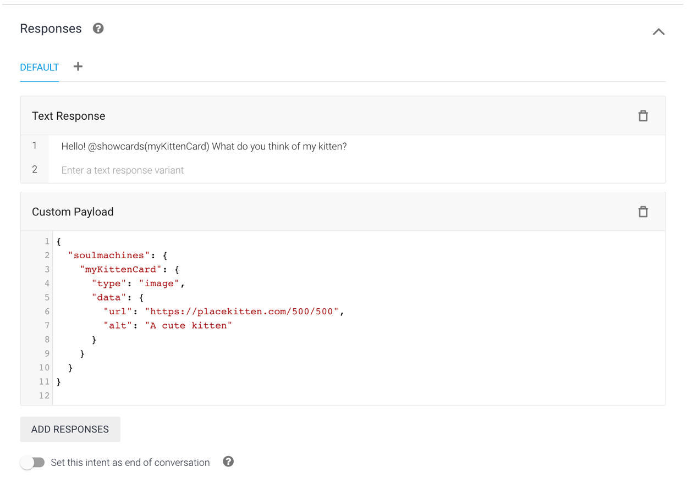

The format of the custom payload should be a JSON object containing a `soulmachines` property. All content cards should be defined within this `soulmachines` object.

The `soulmachines` object can contain any data structure, and the whole thing will be passed to the UI. There are no restrictions on the format of the `soulmachines` object other than it must be valid JSON.

For sending content card data using the `soulmachines` custom payload property, it is recommended to define each content card as an individual property of that object to allow for easy lookup of cards by their IDs on the Custom UI side.

This example shows how you could format the `soulmachines` object to send a card representing an image, using the custom payload response type:

```json
{
  "soulmachines": {
    "myKittenCard": {
      "type": "image",
      "data": {
        "url": "https://placekitten.com/500/500",
        "alt": "A cute kitten"
      }
    }
  }
}
```

The `myKittenCard` property name is the card's unique ID, and needs to match up with the card ID passed to the showcards speech marker, for example:

```ts
Hello! @showcards(myKittenCard) What do you think of my kitten?
```

The Custom UI can then use the showcards event handler to look up the card data received with the ID `myKittenCard`.

### DialogFlow CX

Dialogflow CX passes back card data in the Parameters of a response. The card name should be entered in the Display Name field when adding a parameter, while the card data should be entered in the Default Value field (this is a string field so JSON validation is unavailable. Quotation marks do not need to be escaped). The Entity Type should be set to `@sys.any`.

The card name requires the `public-` prefix but this should be excluded from the argument used in the @showcards command (e.g. parameter name - `public-image`; dialog function in response - `@showcards(image)`).

Parameter:

```json
Display Name: public-image
Entity Type: @sys.any
Default Value: { "component": "image", "data": { "url":"https://placekitten.com/500/500" } }
```

Response:

```js
This is a @showcards(image) cat.
```
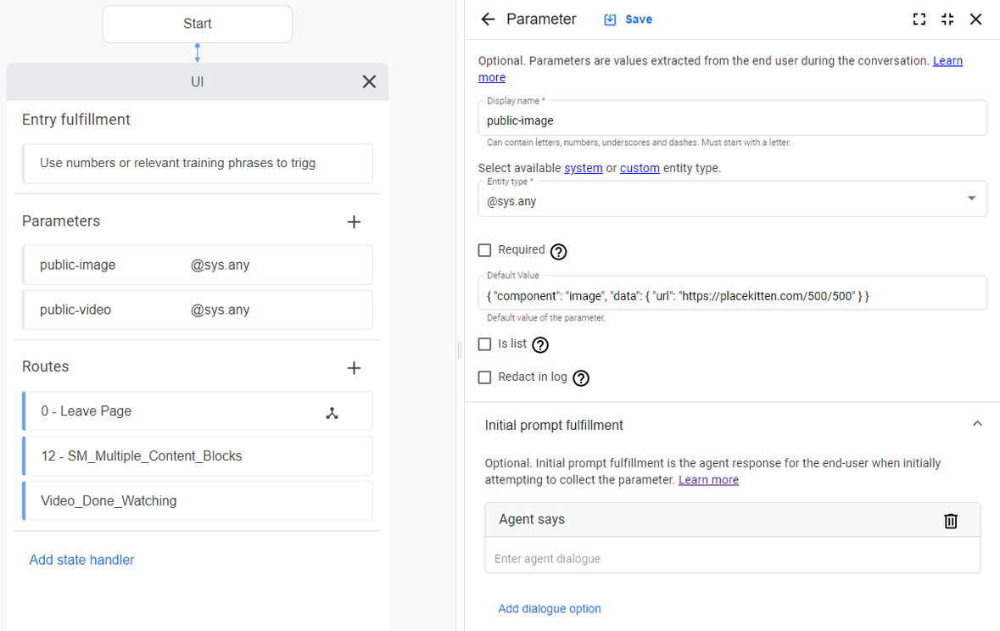

### Watson Assistant (Classic)

Watson passes card data back using Context Variables. These variables are persistent for the duration of the session so they only need to be defined once before or as they’re about to be used. The variables can be changed and reused at any point in conversation, though if the card is already on screen, the change will have to be triggered by either the conversation or the custom UI needs to detect the change.

The card name requires the `public-` prefix but this should be excluded from the argument used in the \@showcards command (e.g. parameter name - `public-image`; dialog function in response - `\@showcards(image)`).

For Watson the `\@showcards()` and `\@hidecards()` commands need to be escaped with a `\`.

This example shows how you can use Context Variables to send a content card to the UI:

```json
"context": {
    "public-myKittenCard": {
      "type": "image",
      "data": {
        "alt": "A cute kitten",
        "url": "https://placekitten.com/500/500"
      },
    }
}
```

The `myKittenCard` property name is the card's unique ID, and needs to match up with the card ID passed to the showcards speech marker, for example:

```js
Hello! \@showcards(myKittenCard) What do you think of my kitten?
```

The Custom UI can then use the showcards event handler to look up the card data received with the ID `myKittenCard`.

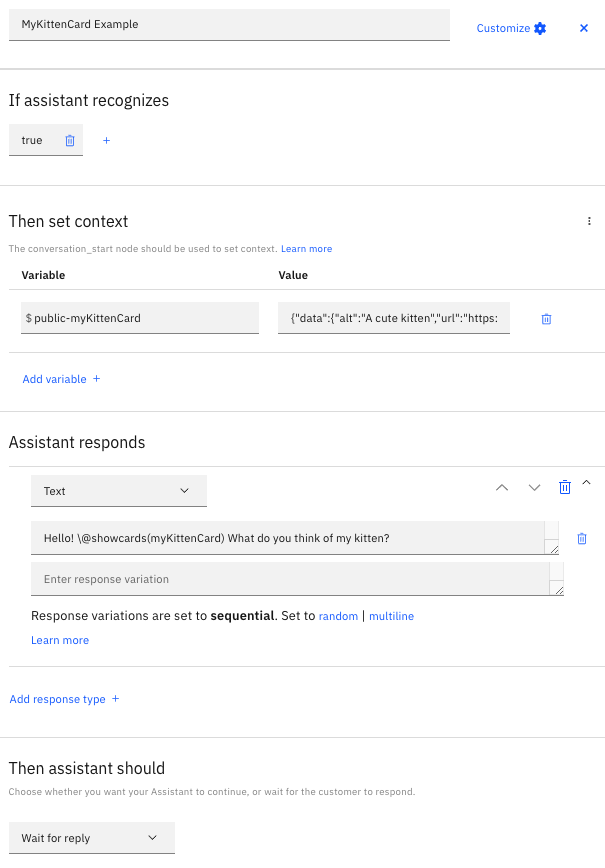

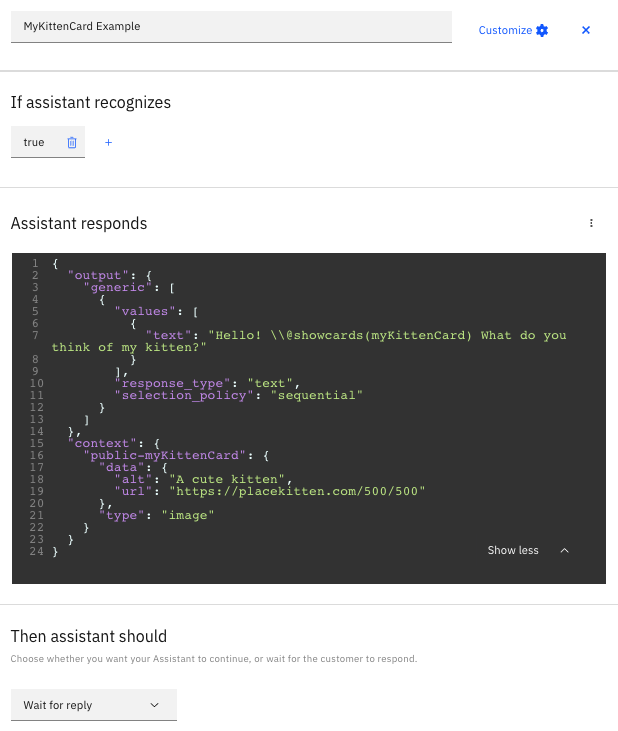

### Watson Assistant (New)
#### Watson content blocks

New Watson Assistant Skill supports all the available platform response types. However, in case of the **Options** and/or **Confirmation** responses, the `@showcards()` markup tag needs to be specified. Otherwise these response types will not work as expected. The screenshot below, shows an example of how the `@showcards()` markup tag is specified.

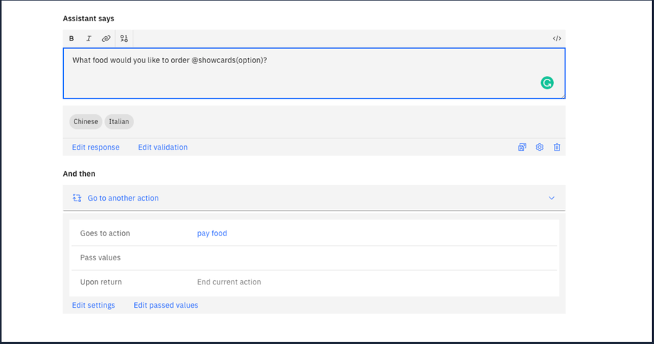

#### Soul Machines Content blocks

The Soul Machines content block has to be defined in **response_type: user_defined** with the below-defined format:

:::info
**id** should be same as `@showcards(id)`
:::

Sample options card:

```json
{
      "user_defined": {
        "id": "sampleOptionsCard",
        "data": {
          "options": [
            {
              "label": "One",
              "value": "value one"
            },
            {
              "label": "Two",
              "value": "value two"
            },
            {
              "label": "Three",
              "value": "value three"
            }
          ]
        },
        "type": "options"
      },
      "response_type": "user_defined"
    }
```

Sample image card:

```json
{
    "user_defined": {
      "id": "sampleImageCard",
      "data": {
        "alt": "This is a dog",
        "url": "https://source.unsplash.com/user/c_v_r/1900x800"
        },
       "type": "image"
      },
    "response_type": "user_defined"
  }
```
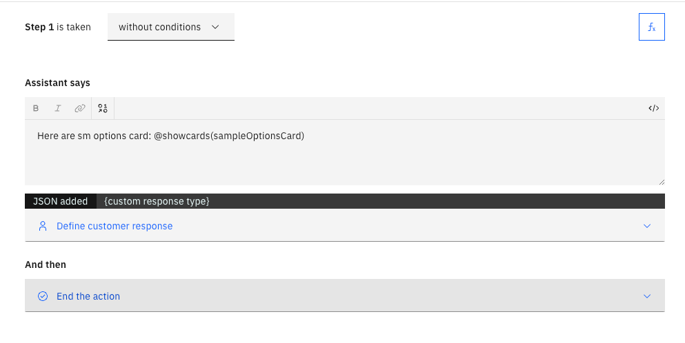

### Kore AI
Content cards are supported by adding the necessary variables to a User prompt:

1. Click **Manage** in a message Bot Response as shown below:
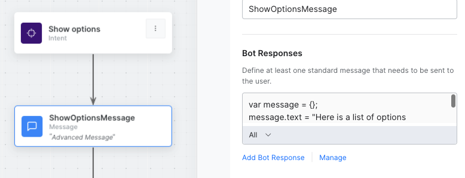

2.Expand the user prompt view and click on Advanced (you need to clear the default Plain Text first)
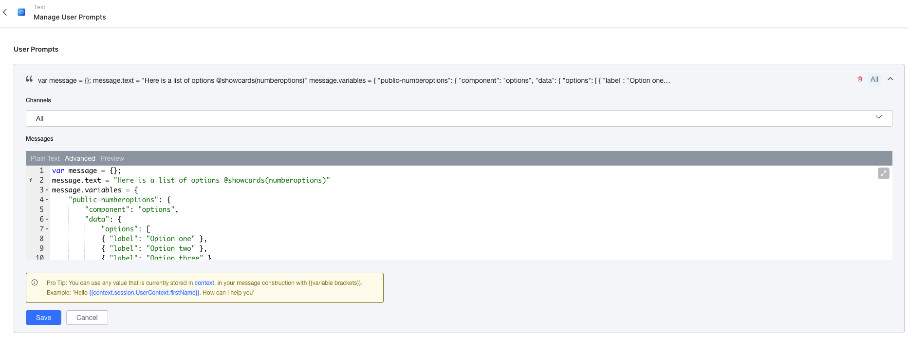

Here is an example snippet that shows an image card:

```json
var message = {};
message.text = "Here is a picture of a cat @showcards(cat)"
message.variables = {
    "public-cat": {
        "component": "image",
        "data": {
            "url": "https://placekitten.com/300/300",
            "alt": "A cute kitten",
        },
    },
}
print(JSON.stringify(message));

```
:::info
You need to use `@showcards()` in the text for the card to be displayed, the name of the card references the name of the public variable (“cat”, in this example).
:::
### Microsoft Azure Bot Service

Context properties/variables can be used to save conversation state to be used at a later point in the conversation, e.g. for the card info. The Bot should set context variables in the conversation scope and return the conversation object in responses to share this with the SDK. 

For example, to set a component to be shown in a @showcards() function the component needs to be set using the same naming convention as with other conversation providers (prefixed with conversation.public-) and the conversation needs to be returned in the Value field of the response:
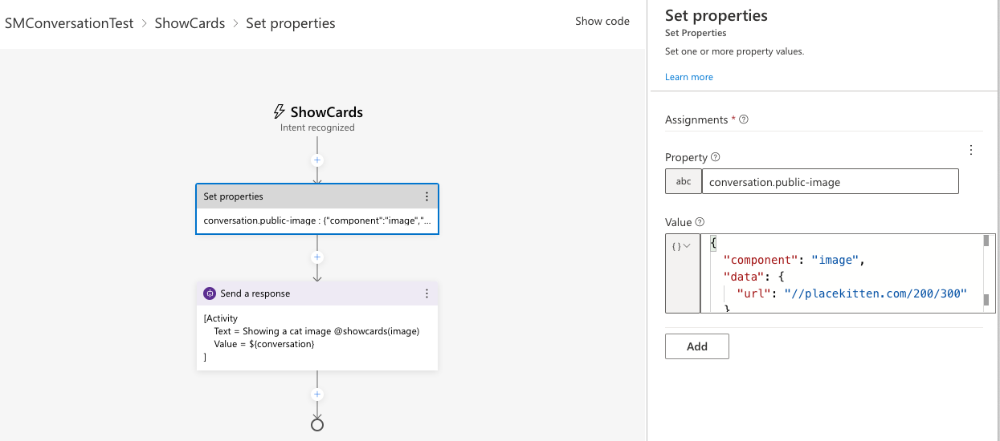

### Amazon Lex
You can make use of content cards by adding a `customisable payload response`, click “More response options” in a response message group, add a customisable payload, and specify the corresponding json data within that text area. In this example, a `cat` card is defined in the json data, and referenced by the text in the `@showcards(cat)` part of the response.

:::info
The card name specified in json doesn’t need to be prepended by `public-` like in other integrations. Also make sure that the json is valid and doesn’t contain any extra commas.
:::

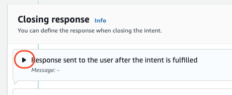
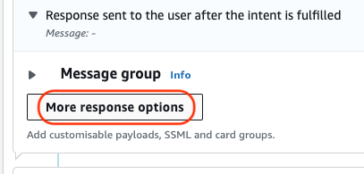
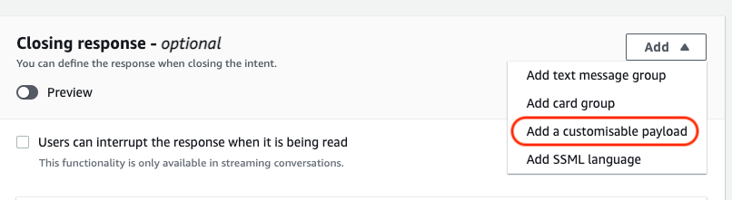
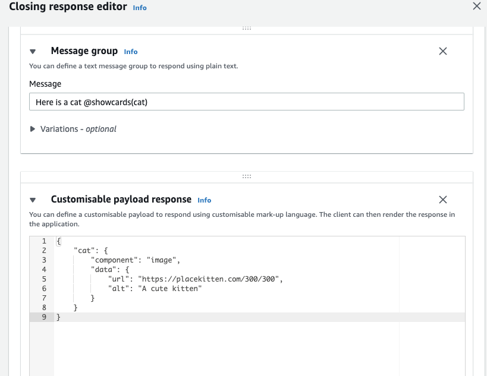

```json
{
    "cat": {
      "component": "image",
      "data": {
        "url": "https://placekitten.com/500/500",
        "alt": "A cute kitten"
      }
    }
}
```