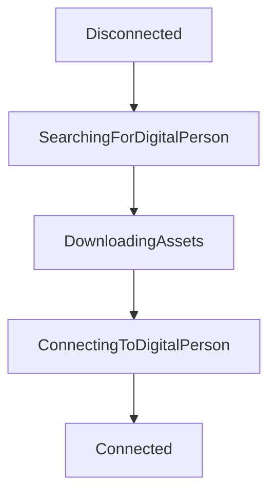

# Connection State

The connection speed to the Digital Person (DP) varies due to time, location, and  internet speed, which makes visibility into the state of the loading process important for user experience. To display the connection progress, Connection state events are available for use (e.g. to customise the loading interface before the connection succeeds). To this end, infrastructure has been put together that classifies the connection as being in one of the following `ConnectionStateTypes`:

- `Disconnected`
- `SearchingForDigitalPerson`
- `DownloadingAssets`
- `ConnectingToDigitalPerson`
- `Connected`

When `scene.connect()` is called, the connection process has started. It will go through following steps.

1. `SearchingForDigitalPerson` - open websocket connection to DP server, searching for an available DP, may require queuing
2. `DownloadingAssets` - DP is found, starting downloading assets
3. `ConnectingToDigitalPerson` - DP is starting, forming webrtc connection
4. `Connected` - DP is ready, webrtc session has connected



## Subscribing to Connection State/Progress

After creating the `Scene`, you can add callback function to handle connection state before calling the `connect()` method of `Scene` to get the connection progress updates. 

```javascript
  scene.connectionState.onConnectionStateUpdated.addListener(
    (connectionStateData: ConnectionStateData) => {
    // callback handling for connectionState updates
});
```

The callback will receive the current `connectionStateData`. If you are using typescript you can import the type `ConnectionStateData` from the Web SDK. 

Example of the data you will receive in the callback as below. You can use the suggested `percentageLoaded` value to update a progress bar, or use `currentStep` value to indicate the progress.

```
    name: Disconnected
    currentStep: 0
    totalSteps: 5
    percentageLoaded:0

    name: SearchingForDigitalPerson
    currentStep: 1
    totalSteps: 5
    percentageLoaded:25

    name: DownloadingAssets
    currentStep: 2
    totalSteps: 5
    percentageLoaded:50

    name: ConnectingToDigitalPerson
    currentStep: 3
    totalSteps: 5
    percentageLoaded:75

    name: Connected
    currentStep: 4
    totalSteps: 5
    percentageLoaded:100
```