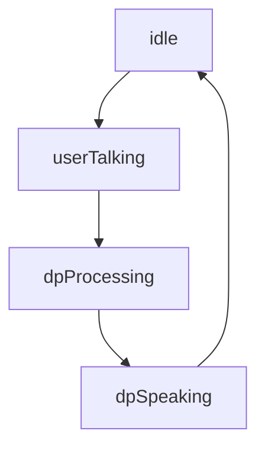

# Conversation State

When interacting with the Digital Person (DP) it can be useful to know at a glance what state the DP is in. To this end, infrastructure has been put together that classifies the DP as being in one of the following [`ConversationStateTypes`](../api/smwebsdk.conversationstatetypes.md):

- `idle`
- `dpSpeaking`
- `userTalking`
- `dpProcessing`

There are no unique state transitions, instead all of the states can transfer to any other state. While any transition is possible, generally the state transitions will follow the below pattern except in the event of an error:



## Subscribing to Conversation State Updates

After accessing the [`Scene`](../api/smwebsdk.scene.md) for the `Persona` associated with the DP (how to do this is detailed in the [overview](../overview.md)) the `ConversationState` object can be accessed. The below example assumes that an instance of `Scene` called `scene` has been created. For more information on how to create and work with a `Scene` see the [Overview](../overview.md)

```javascript
scene.conversation.onConversationStateUpdated.addListener(
    (conversationState:ConversationStateTypes) => {
        // callback handling for conversationState updates
    }
);
```

The callback will receive the current `conversationState`. If you are using typescript you can import the type [`ConversationStateTypes`](../api/smwebsdk.conversationstatetypes.md) from the Web SDK. [The API entry on `ConversationStateTypes`](../api/smwebsdk.conversationstatetypes.md) contains more information.

